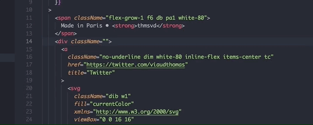

# Tachyons CSS Snippets

This extension provides snippets for all tachyons css classes.

## Features

Stop losing time `Ctrl+F` tachyons css to find your needs. This extensions allows you to find tachyons classes either by typing the name or css contained in the class directly in your code.

**Supported languages :** `html`, `javascript`, `jsx`, `reason`, `typescriptreact`.



## Known issues

Snippets are accessible with `Ctrl+Space`.
However, if you want to use the quicksuggestions feature you might need to add :

```
  "editor.quickSuggestions": {
    "other": true,
    "comments": false,
    "strings": true
  }
```

in your editor config. For non html files, we need to enable autosuggestions in strings.

## Release Notes

### 0.0.1

Initial release of tachyons-snippets
